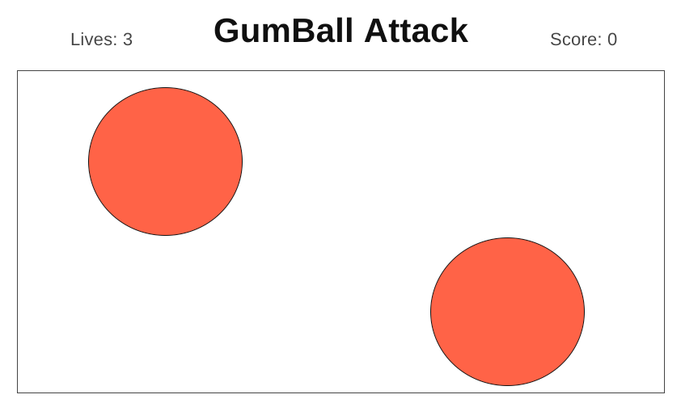

# GumBall Attack!

[Play]('https://itspanicky.github.io/GumBall-Attack/')

#### Gumball Attack! is built using HTML5 Canvas and Vanilla Javascript based on object-oriented principles. Web Audio API is incorporated to add sound effects for a more enjoyable gameplay. Webpack is used to bundle all scripts into a single source.

## Background and Overview
GumBall Attack is a simple arcade game with basic controls. The gameplay involves controlling a character left or right while dodging bouncing giant gumballs. The character can also shoot projectiles straight up, which on impact with a gumball will split the gumball into two smaller gumballs.

Although a seemingly easy concept, GumBall Attack becomes more difficult as there are more bouncing gumballs.

The inspiration for GumBall Attack comes a game called Bubble Struggle, which I played countless times for hours as a kid.

## Functionality and MVP
### Functionality
- Users can press left/right arrow keys to most in that direction.
- Circles (gumballs) will bounce within the border of the game.
- Gumballs will split into two smaller gumballs when it collides with a projectile
- The game ends when all lives are lost and a life is lost when a gumball collides with the player.

### MVP
- Interactive starting screen
- Player can move avatar
- Avatar can shoot projectile that can collide with gumballs
- Gumballs can bounce along walls of game
- Gumballs can split into a two smaller gumballs upon collision with a projectile
- Gumballs can cause lost of life or game over upon collision with avatar 
- Lives can be tracked
- Levels can be tracked

## Wireframe

The app will consist of a transparent starting screen with the gumballs bouncing in the background. There will be a play button, a instructions button, a scoreboard button, a mute button, and links to the Github repository and developer LinkedIn.

When hitting the play button, the game will start immediately with the avatar rendering on the screen and the starting screen will fade out.

When the game is over, a replay button will render.

## Architecture and Technologies
- Vanilla javascript for game logic.
- HTML5 canvas for game rendering.
- Web Audio API to handle music and sound effect.
- Webpack to bundle scripts into a single source.

## Implementation and Timeline
#### Day 1:
- Files setup
- Learn OOP for canvas with javascript
#### Day 2:
- Gumball rendering
- Avatar rendering and functionality
    - Movement
#### Day 3:
- Gumball functionality
    - Bounce
    - Collisions
- Projectile rendering and functionality
    - Collisions
#### Day 4:
- Game logic
    - Lives
- Game menu
    - Start
    - Retry
    - Next Level
#### Day 5:
- Style page
- Bonus features
## Bonus features
- item pick up for different projectiles
- scoreboard save to database

## Credit
- Avatar - https://www.gameart2d.com/the-boy---free-sprites.html
